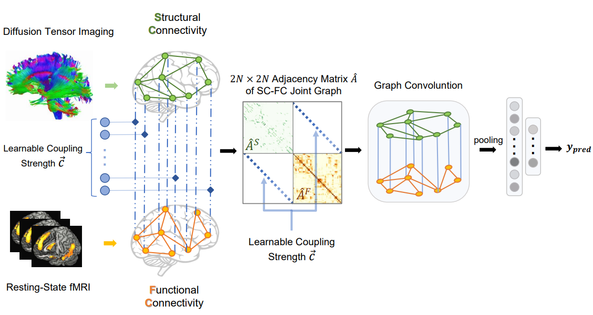

# brain_gcn
## Introduction
In this work, we propose to couple the two networks of an individual by adding inter-network edges between corresponding brain regions, so that the joint structure-function graph can be directly analyzed by a single GCN. The weights of inter-network edges are learnable, reflecting non-uniform structure-function coupling strength across the brain. 

We apply our Joint-GCN to predict age and sex of 662 participants from the public dataset of the National Consortium on Alcohol and Neurodevelopment in Adolescence (NCANDA) based on their functional and micro-structural white-matter networks.


## Dataset Link
https://cnslab.stanford.edu/data
## Running Experiments
To run sex prediction task:
```
$ python train.py --model GCN_general_L_W --task sex_predict
```
To run age prediction task:
```
$ python train.py --model GCN_general_L_W --task age_predict
```
## References
If you find this repo helpful, please consider giving a star and citing the following paper:

Li Y, Wei Q, Adeli E, Pohl K, Zhao Q: Joint Graph Convolution for Analyzing Brain Structural and Functional Connectome, Medical Image Computing and Computer Assisted Intervention, Springer-Verlag, Lecture Notes in Computer Science, Accepted

## Contacts
If any questions, welcome email: lyt1314@stanford.edu
